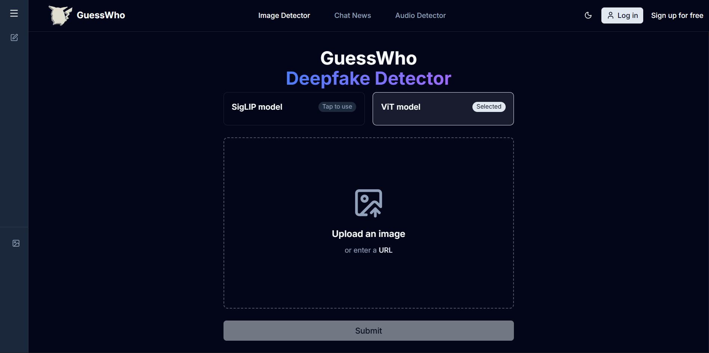

# Deepfake Detector & Facts Verifier

## Overview

This application is a comprehensive tool designed to combat misinformation through two primary mechanisms: a **Deepfake Image Detector** and a **Facts Verifier Chatbot**. It combines a modern Next.js frontend with a robust FastAPI backend to provide real-time analysis and verification.

The Deepfake Detector allows users to upload images and receive an instant probability assessment of whether the image is real or AI-generated. It is powered by robust vision models, specifically custom fine-tuned versions of SigLIP and Vision Transformer (ViT), adapted using LoRA to accurately identify AI-generated artifacts.

The Facts Verifier is an intelligent chatbot that classifies user queries and, when necessary, performs real-time web searches to verify claims against trusted sources. It orchestrates advanced Large Language Models (LLMs) via Groq and OpenRouter using LangChain to analyze query intent, construct optimized search queries, and synthesize factual, cited responses.

## Key Features

### 🕵️ Deepfake Image Detector

- **Dual-Model Architecture**: Utilizes two state-of-the-art models for robust detection.
- **Real-Time Analysis**: Upload an image to get immediate feedback.
- **Detailed Probabilities**: Returns the confidence score for both "Fake" and "Real" classifications.
- **Strict Thresholding**: Classifies an image as "Real" only if the probability exceeds 90%, minimizing false negatives for fake content.

### 🤖 Facts Verifier (Chatbot)

- **Intelligent Query Classification**: Automatically determines if a user's query requires external verification (e.g., breaking news, recent events) or if it can be answered with general knowledge.
- **Real-Time Web Search**: Integrates with **Tavily Search** to fetch the latest information from the web when verification is needed.
- **Source Attribution**: Provides summaries and cites sources for verified facts.
- **Conversation History**: Maintains context within a session for follow-up questions.

## Backend Models sourced from Hugging Face

The Deepfake Detection service is powered by the following models sourced from Hugging Face:

- **[shunda012/siglip-deepfake-detector](https://huggingface.co/shunda012/siglip-deepfake-detector)**: A SigLIP-based model fine-tuned for deepfake detection.
- **[shunda012/vit-deepfake-detector](https://huggingface.co/shunda012/vit-deepfake-detector)**: A Vision Transformer (ViT) based model fine-tuned for deepfake detection.

Both models are implemented with LoRA (Low-Rank Adaptation) for efficient inference.

## Tech Stack

### Frontend

- **Framework**: Next.js 15 (App Router)
- **Language**: TypeScript
- **Styling**: Tailwind CSS, Shadcn UI
- **Icons**: Lucide React, React Icons

### Backend

- **Framework**: FastAPI
- **Language**: Python 3.12+
- **ML/AI Libraries**: PyTorch, Transformers, PEFT (Parameter-Efficient Fine-Tuning)
- **LLM Orchestration**: LangChain, OpenRouter, Groq
- **Search Engine**: Tavily API
- **Database**: Supabase (PostgreSQL) with Prisma ORM

## Getting Started

### Demonstration

Checkout: https://deepfake-web-nine.vercel.app

## License

This project is open source and available under the **MIT License**.
